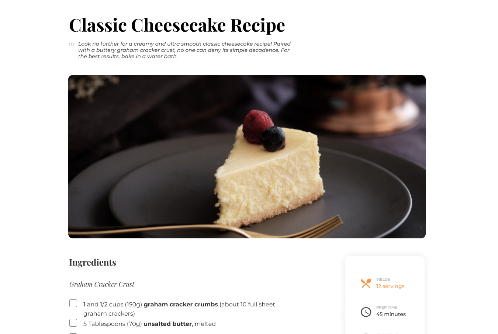

## Table of Contents

- [Overview](#overview)
- [Built With](#built-with)
- [Features](#features)
- [How to use](#how-to-use)
- [Contact](#contact)

---

## Overview

### Built With

- [Font Awesome](https://fontawesome.com/)
- [Google Fonts](https://fonts.google.com/)
- [Bootstrap](https://getbootstrap.com/)
- [Sass](https://sass-lang.com/)

## Features

This application/site was created as a submission to a [DevChallenges](https://devchallenges.io/challenges) challenge. 

## How To Use

To clone and run this application, you'll need [Git](https://git-scm.com) and [Node.js](https://nodejs.org/en/download/) (which comes with [npm](http://npmjs.com)) installed on your computer. From your command line:

## Contact

- GitHub [@cockatiella](https://github.com/cockatiella)

